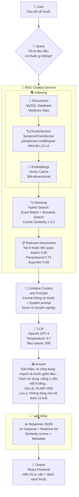

```mermaid
graph TB

%% User Input
U[👤 User\nCâu hỏi về thuốc] --> Q{📝 Query\nTôi bị đau đầu,\ncó thuốc gì không?}

%% RAG Process Box
subgraph RAG ["🤖 RAG Chatbot Service"]
    direction TB

    %% Indexing Section
    subgraph IDX ["📚 Indexing"]
        direction TB
        DOC[📄 Documents\nMySQL Database\nMedicine Data]
        CHUNK[🔤 Chunk/Vectors\nSentenceTransformer\nparaphrase-multilingual-MiniLM-L12-v2]
        EMB[🧠 Embeddings\nVector Cache\n384-dimensional]
        DOC --> CHUNK --> EMB
    end

    %% Retrieval Section
    RET[🔍 Retrieval\nHybrid Search:\nExact Match + Semantic Search\nCosine Similarity ≥ 0.3]

    %% Relevant Documents
    REL[📋 Relevant Documents\nTop 5 thuốc liên quan:\nAspirin 0.85\nParacetamol 0.72\nIbuprofen 0.68]

    EMB --> RET
    RET --> REL
end

%% LLM Generation
Q --> RAG
REL --> COMB[🔄 Combine Context\nand Prompts\nFormat thông tin thuốc\n+ System prompt\nDược sĩ chuyên nghiệp]

COMB --> LLM[🧠 LLM\nOpenAI GPT-4\nTemperature: 0.7\nMax tokens: 500]

%% Output
LLM --> ANS[📤 Answer\nGiới thiệu và công dụng: Aspirin là thuốc giảm đau...\nCách sử dụng: Uống 1 viên mỗi 8 tiếng...\nGiá cả: 25,000 VND\nLưu ý: Không dùng cho trẻ dưới 12 tuổi]

%% Response with RAG
subgraph RESP ["✅ with RAG"]
    FINAL[📊 Response JSON\nAI response + Medicine list\nSimilarity scores + Metadata]
end

ANS --> FINAL
FINAL --> OUT[📱 Output\nReact Frontend\nHiển thị tư vấn + danh sách thuốc]
```
